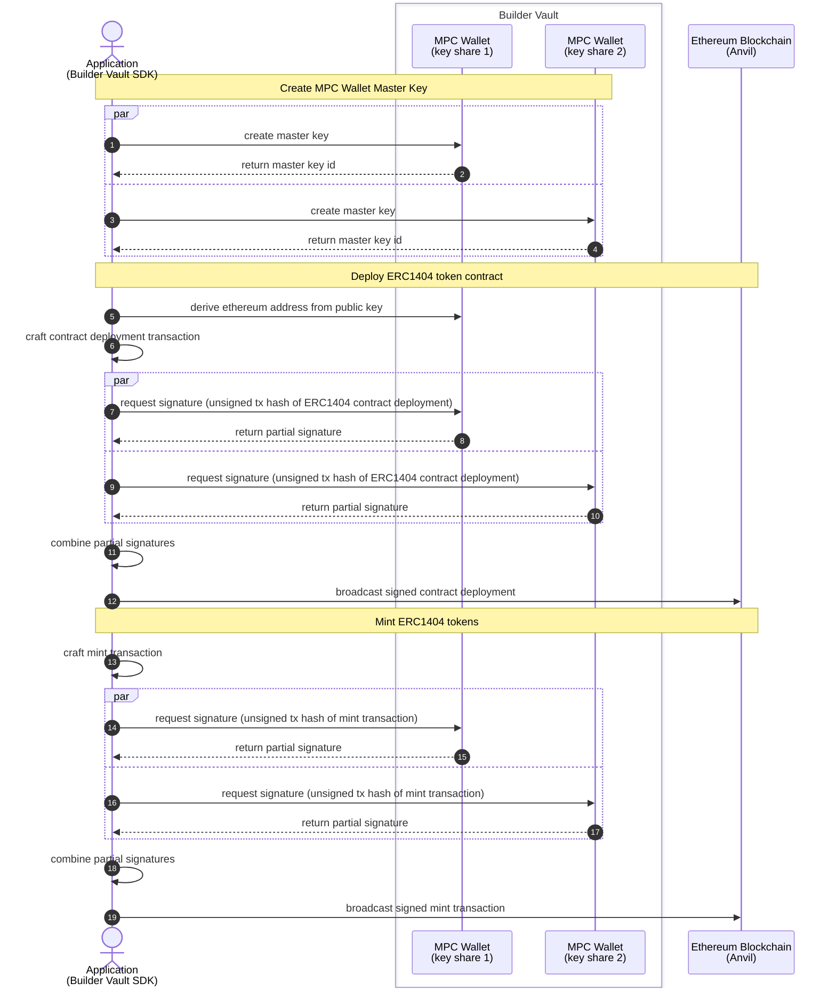

# Demo Builder Vault ERC token deployment
- Runs local Ethereum chain fork - Anvil
- Creates MPC wallet master key with 2 key shares
- Derives wallet addresses from master key
- Funds wallet with anvil override RPC
- Deploys sample ERC1404 token contract
- Mints tokens to recipient wallet



### Prerequisites
  - [Node.js ^v24.0.1](https://nodejs.org/en/download)
  - [Foundry toolchain](https://github.com/foundry-rs/foundry?tab=readme-ov-file#installation)
  - Register for Builder Vault sandbox access: https://www.blockdaemon.com/get-started/builder-vault-sandbox-registration
    - Extract authentication certificate key-pair from registration email bundle into working directory

## Step 1. Install dependencies
```shell
# Install Foundry
curl -L https://foundry.paradigm.xyz | bash
foundryup

# Set Builder Vault nodejsSDK public repository
npm config set @sepior:registry=https://gitlab.com/api/v4/projects/56306653/packages/npm/   
npm install # Installs Builder Vault Web3 Provider
```

### Step 2. Run local EVM chain
```shell
anvil
```

### Step 3. Generate BuilderVault Wallet Master Key for use with transaction signing operations
  - note the MPC Master Key ID output for use with environment variable `MASTERKEY` in the next step.
```shell
node generate-masterkey.ts
```

### Step 4. Run sample app with [BuilderVault Web3 Provider](https://github.com/Blockdaemon/buildervault-web3-provider) to deploy ERC1404 token contract and mint tokens
```shell
MASTERKEY=<master-key-id> NODE_ENV=development node main.ts
```
